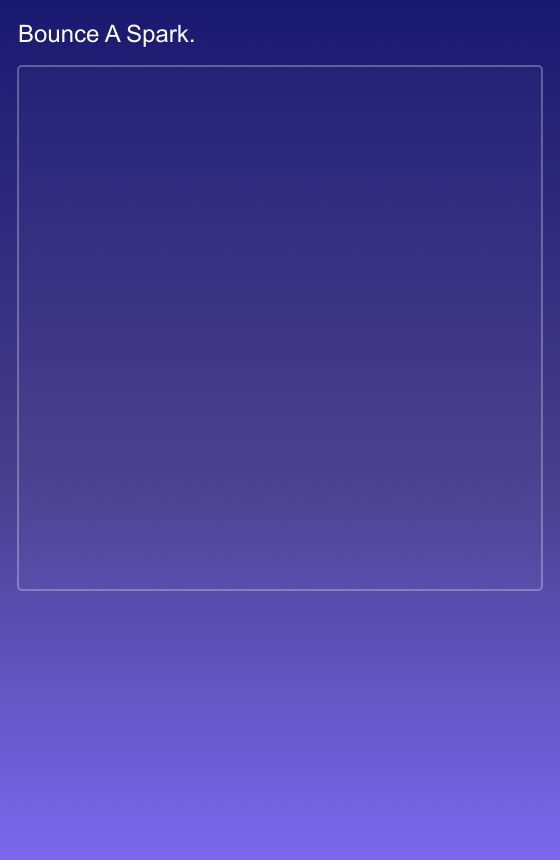

<h2 class="c-project-heading--task">Start main.js</h2>

Build `script.js` so the project can open a canvas and store the spark position and speed.

### Step 1

Open the blank `script.js` from the file list. This is where we will build the sketch.

### Step 2

Add the starting variables for the spark. Then create `setup()` and an empty `draw()` function. In `setup()`, make a `400` by `400` canvas, send it into the `sketch-holder` div, and centre any text you draw.

--- code ---
---
language: javascript
filename: script.js
line_numbers: true
line_number_start: 1
line_highlights:
---
let sparkX = 300;
let sparkY = 260;
let sparkSpeedX = 4;
let sparkSpeedY = -5;

function setup() {
  const canvas = createCanvas(400, 400);
  canvas.parent("sketch-holder");
  textAlign(CENTER, CENTER);
}

function draw() {
}
--- /code ---

<h2 class="c-project-heading--task">Test</h2>

Run the project and check that the page shows a square sketch area under the instructions.

  

