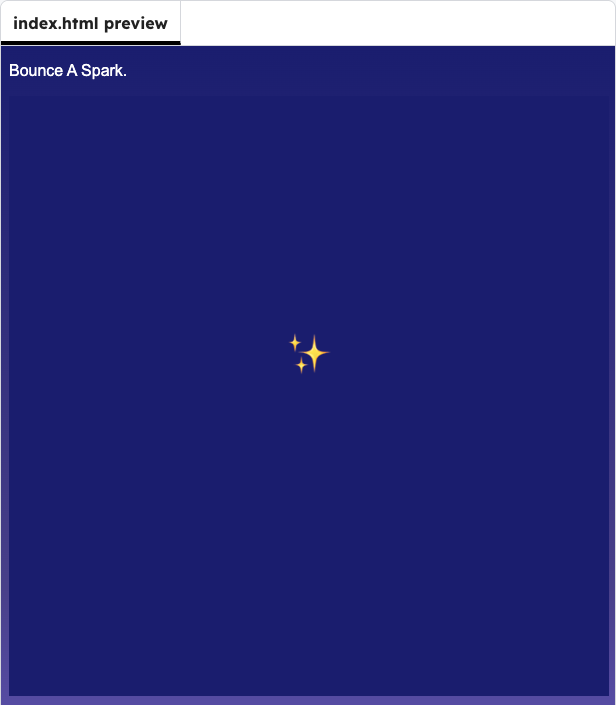

<h2 class="c-project-heading--task">Draw the Spark</h2>

Draw the spark on the canvas.

### Step 1

The background is ready, but the spark is not visible yet. Add code to draw the spark.

### Step 2

Set a text size and draw the `✨` emoji at `sparkX` and `sparkY`.

--- code ---
---
language: javascript
filename: script.js
line_numbers: true
line_number_start: 12
line_highlights: 15-16
---
function draw() {
  background("midnightblue");

  textSize(44);
  text("✨", sparkX, sparkY);
}
--- /code ---

<h2 class="c-project-heading--task">Test</h2>

Run the project and check that the spark appears on the canvas.

  

