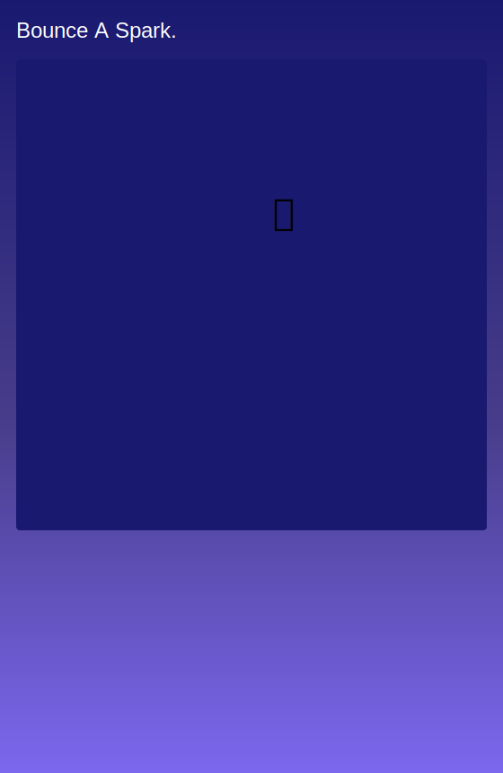

<h2 class="c-project-heading--task">Move the Spark</h2>

Use the draw loop to move the spark across the sketch.

### Step 1

The spark is visible, but it stays still. Change `sparkX` and `sparkY` inside `draw()` so the spark moves every frame.

### Step 2

Store the mouse position in `orbX`, then add the spark speeds to the spark position.

--- code ---
---
language: javascript
filename: script.js
line_numbers: true
line_number_start: 12
line_highlights: 15-17
---
function draw() {
  background("midnightblue");

  orbX = mouseX || orbX;
  sparkX = sparkX + sparkSpeedX;
  sparkY = sparkY + sparkSpeedY;

  textSize(44);
  text("✨", sparkX, sparkY);
}
--- /code ---

<h2 class="c-project-heading--task">Test</h2>

Run the project and watch the spark move across the canvas.

  

