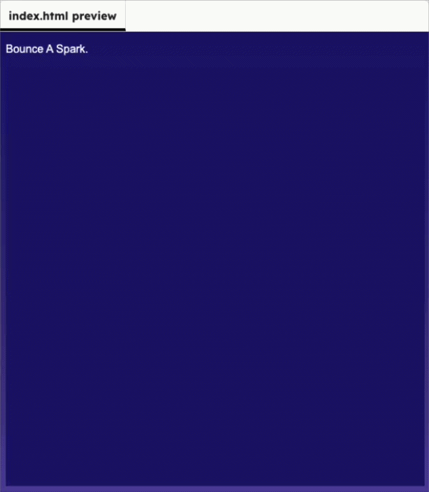

<h2 class="c-project-heading--task">Bounce of top and bottom</h2>

Add a check so the spark bounces off the top wall.

### Step 2

Check whether `sparkY` has reached the top or bottom of the canvas. If it has, reverse `sparkSpeedY`.

--- code ---
---
language: javascript
filename: script.js
line_numbers: true
line_number_start: 12
line_highlights: 19-21
---
function draw() {
  background("midnightblue");

  orbX = mouseX || orbX;
  sparkX = sparkX + sparkSpeedX;
  sparkY = sparkY + sparkSpeedY;

  if (sparkY < 20 || sparkY > height - 20) {
    sparkSpeedY *= -1;
  }

  textSize(44);
  text("✨", sparkX, sparkY);
}
 

--- /code ---

<h2 class="c-project-heading--task">Test</h2>

Run the project and watch the spark bounce off the top edge.

  

