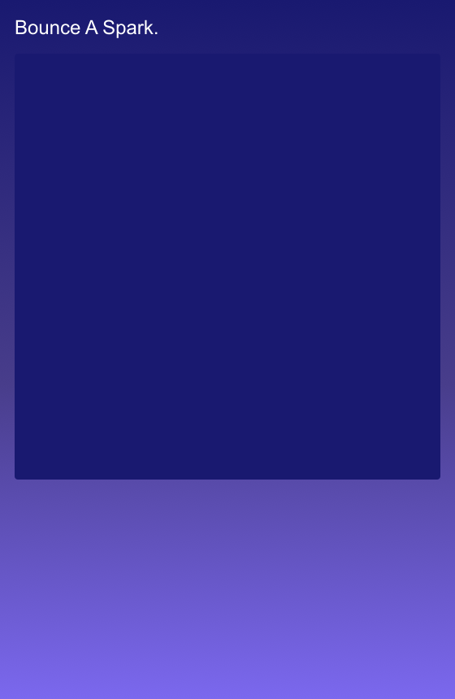

<h2 class="c-project-heading--task">Bounce Sideways</h2>

Make the spark bounce away when it reaches the left or right edge.

### Step 1

The spark is moving, but it will disappear once it leaves the canvas. Add a check so it bounces back from the side walls.

### Step 2

Check whether `sparkX` has reached either side of the canvas. If it has, reverse `sparkSpeedX`.

--- code ---
---
language: javascript
filename: script.js
line_numbers: true
line_number_start: 12
line_highlights: 19-21
---
function draw() {
  background("midnightblue");

  orbX = mouseX || orbX;
  sparkX = sparkX + sparkSpeedX;
  sparkY = sparkY + sparkSpeedY;

  if (sparkX < 20 || sparkX > width - 20) {
    sparkSpeedX *= -1;
  }

  textSize(44);
  text("✨", sparkX, sparkY);
}
--- /code ---

<h2 class="c-project-heading--task">Test</h2>

Run the project and watch the spark bounce off the left and right edges.

  

