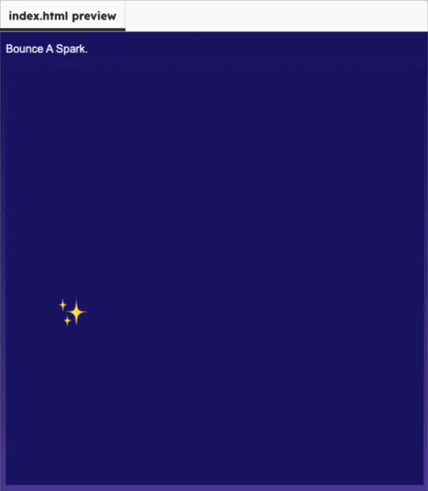

<h2 class="c-project-heading--task">Bounce off sides</h2>

Make the spark bounce when it reaches the left or right edge.

### Step 2

Check whether `sparkX` has reached either side of the canvas. If it has, reverse `sparkSpeedX`.

--- code ---
---
language: javascript
filename: script.js
line_numbers: true
line_number_start: 19
line_highlights: 23-25
---

  if (sparkY < 20 || sparkY > height - 20) {
    sparkSpeedY *= -1;
  }
  
  if (sparkX < 20 || sparkX > width - 20) {
    sparkSpeedX *= -1;
  }

--- /code ---

<h2 class="c-project-heading--task">Test</h2>

Run the project and watch the spark bounce around the whole canvas.

  

